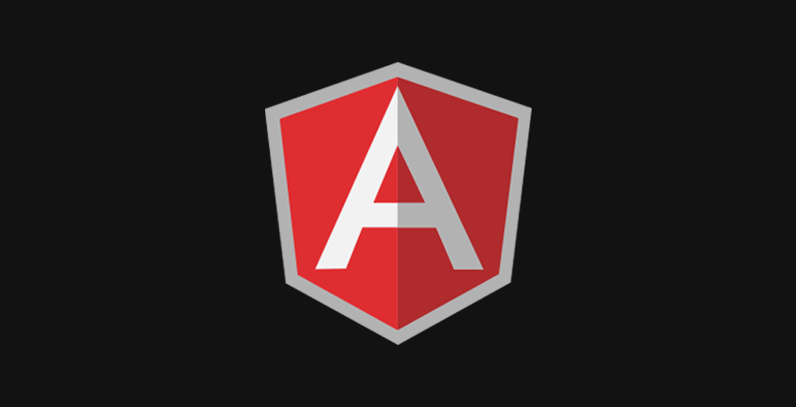

# Angular  Course 👨‍🏫 For Beginners 🐐
<p> </p>


)

# What 🤔 is  Angular 
<p>Angular is a JavaScript <span style="color: gold"> FrameWork</span>
which allows us to create <span style="color: gold"> Single page Applications</span>(SAP).</p>

**what is A FrameWork**📌</br>
A FrameWork is like a platform for developing software it can have pre-defined classes
and functions that can be re-used to add several functionalities,
which otherwise we would have to write from scratch by our own </br> 
**what is Single Page Application(SAP)** 📌</br>
A single page application is a web application,which has only one HTML page. When we 
navigate around , only the content of that page changes . the page itself never changes
Advantage of SAP.
Since we are using JavaScript to change the content of the page it is much Faster , 
Here we are not reaching out to the server to request a new place of HTML data every time we navigate to a different URL

### why we're using angular framework 
Limitation f JavaScript /JQuery
- Vanilla JavaScript or jQuery code becomes hard to maintain and we will need a way to properly structure our apllication
- A lot of applications built using vanilla JavaScript or JQuery is hard to test 
- There are some functionalities which we will have to write from scratch when using JavaScript/JQuery
### Advantage of using Angular ✅
- Angular gives our apllication a clean and loosely coupled structure that is essay to understand and maintain   
- it brings a lot of utility code which can be re-used in a lot of application Especially . when dealing withe user navigation and browser history 
- Application build with Angular are more testable  
### Angular versioning and releases
<p> AngularJS is the first version of the Angular framework,
while Angular refers to the newer versions (Angular 2 and above). AngularJS is a JavaScript-based framework, 
while Angular uses TypeScript, a statically typed superset of JavaScript. 
Angular provides improved performance, scalability, and features compared to AngularJS.</p>

### Setup environment to work with angular
> **1: Install Node.js [Node.Js](https://nodejs.org/en)**
> *Node.js is an open-source, cross-platform JavaScript runtime environment that allows developers to run JavaScript code outside a web browser. It is built on Chrome's V8 JavaScript engine and is designed for executing server-side scripts. 
> Node.js enables developers to use JavaScript for server-side scripting, creating command-line tools, and building back-end applications, making it a popular choice for building scalable and high-performance web applications*
>> **2:Install npm (Node Package Manager)[Downloading and installing Node.js and npm
](https://docs.npmjs.com/downloading-and-installing-node-js-and-npm)**
>> *is a package manager for the Node.js runtime environment. It is the default package manager for Node.js and is bundled with it. npm allows developers to easily install, share, and manage Node.js modules and libraries, making it easier to build and share JavaScript code*
>>> **3: Install command-line interface [AngularCLI](https://angular.io/cli)**
>>> *is a text-based user interface for interacting with a computer system or software application. It allows users to enter commands using a keyboard, and the system or application will execute those commands and return the results in text form. CLIs are commonly used in software development, system administration, and network administration.
> They provide a powerful and flexible way to interact with complex systems and automate tasks*
### Angular architecture patterns
Angular architecture patterns refer to the various design approaches and best practices for structuring Angular applications to achieve modularity, scalability, maintainability, and performance. Here are some common Angular architecture patterns
<details> 
<summary>Component-Based Architecture:</summary> 
Angular applications are typically built using a component-based architecture where the UI is broken down into reusable and encapsulated components.
Each component is responsible for a specific part of the UI and may contain its logic, templates, styles, and data.</details>
<details>
<summary>Module-Based Architecture</summary>
Angular applications are organized into modules, which help to divide the application into cohesive functional units.
Modules can be feature modules (containing related components, services, and other resources) or shared modules (containing reusable components, pipes, and directives).
</details>
<details>
<summary>Lazy Loading</summary>
Lazy loading is a technique used to improve the performance of Angular applications by <span style="color: chartreuse">loading modules and components asynchronously only when they are required.</span> 
Angular's RouterModule supports lazy loading for routing, allowing you to load modules on demand.
</details>
<details>
<summary>State Management</summary>
Managing application state is crucial for complex Angular applications. Various state management libraries and patterns can be used, such as RxJS, NgRx, Akita, or Angular's built-in services like BehaviorSubject and NgZone.
NgRx is a popular state management library for Angular that implements the Redux pattern using RxJS observables.
</details>
<details>
<summary>Service Layer</summary>
Angular services are used to encapsulate reusable logic, data, and functionality that can be shared across components.
<span style="color: brown; font-weight:bold"> Services should be lean and focused on a single responsibility</span> , following the principles of separation of concerns.
</details>
<details>
<summary>Routing and Navigation:</summary>
Angular's RouterModule provides powerful routing capabilities for navigating between different views or pages in a single-page application.
Properly configuring routing and navigation helps in organizing application structure and providing a seamless user experience.
</details>
<details>
<summary>Forms Handling</summary>
Angular provides support for both template-driven forms and reactive forms.
Depending on the complexity and requirements of the application, you can choose the appropriate form handling approach.

> Note 📍: the template-driven form used for simple forms and the logic of the form treated in the template but 
> the reactive forms they are using for complex forms such as login form and the of the form but in the component 
</details>
<details>
<summary>Error Handling and Logging</summary>
Implementing error handling and logging mechanisms is essential for debugging and maintaining Angular applications.
Angular's ErrorHandler interface can be used to handle errors globally, while logging libraries like Angular Logging Service can be used for logging.
</details>
<details>
<summary>Security:</summary>
Implementing security measures such as authentication, authorization, and protection against common vulnerabilities (e.g., cross-site scripting, cross-site request forgery) is important for Angular applications.
Angular provides built-in features like HttpInterceptor for intercepting HTTP requests and responses to implement authentication and authorization.
</details>
<details>
<summary>Testing</summary>
Writing tests is crucial for ensuring the reliability and maintainability of Angular applications.
Angular provides support for various types of testing, including unit tests, integration tests,
and end-to-end tests using tools like Jasmine, Karma, Protractor, and Angular Testing Library.
</details>

### Create a New Angular Project
```angular2html
ng new my-angular-app

```
### Angular files and folder structure

When you build an Angular application, the Angular CLI (Command Line Interface) or other build tools generate several files that are included in the index.html file during runtime. 
Let's go through the files you mentioned:
- runtime.js: This file contains the code necessary for bootstrapping and running the Angular application at runtime. It includes the runtime environment and Angular's runtime compiler.
- polyfills.js: This file contains polyfills, which are code snippets that provide modern functionality on older browsers that may not support certain features. Angular applications often include polyfills to ensure compatibility with a wide range of browsers.
- styles.js: This file typically includes the styles (CSS) of your Angular application. It contains the compiled styles from your components and global styles.
- vendor.js: This file contains the code from third-party libraries and dependencies used by your Angular application. It includes the Angular framework itself and any other external modules or libraries.
- main.js: This is the main entry point of your Angular application. It usually includes the code responsible for bootstrapping the Angular module, setting up the application environment, and initializing the component tree.
###  Bootstrapping Angular Application
In Angular, bootstrapping refers to the process of initializing 🚀 and running an Angular application. 
It involves loading 💱 the root module of the application which mostly is app.module.ts and then compiling and launching the component tree.
In other words when an Angular application is started, the Angular framework reads the main.ts file, which contains the bootstrap code, and it loads the specified module (AppModule).
The framework then processes the metadata defined in AppModule and initializes the application accordingly. 
The main file responsible for bootstrapping an Angular application is typically named main.ts or main.js.
```
bootstrapApplication(AppComponent, appConfig)
  .catch((err) => console.error(err));
```
>**Note: 📌**
> Angular Project: Angular CLI saves the compile Angular application in the memory and directly start it.
> ng serve: If we make any changes to our Angular app,Angular CLI will recompile and update the file 
> Webpack: Angular CLI uses Webpack to travers through our Angular app, and it bundles js and other files into one or more bundles then Angular CLI also injects the bundled JavaScript and CSS files in the index.html 
### Angular Modules 
In Angular, "modules" are a way to organize an application into cohesive blocks of functionality.
Angular applications are typically built using multiple modules, each serving a specific purpose.
Modules help in organizing the codebase, managing dependencies, and providing a clear structure to the application.<br/>
**There are two types of modules in Angular:**<br/>
**Root Module:** This is the main module of an Angular application, conventionally named AppModule. 
It is typically defined in the app.module.ts file. The root module bootstraps the application 
and contains references to other modules and components that are essential for the application to run.
```angular
// app.module.ts (Root Module)
import { NgModule } from '@angular/core';
import { BrowserModule } from '@angular/platform-browser';
import { AppComponent } from './app.component';

@NgModule({
  declarations: [
    AppComponent
  ],
  imports: [
    BrowserModule
  ],
  providers: [],
  bootstrap: [AppComponent]
})
export class AppModule { }
```
**Feature Modules**: These are additional modules created to encapsulate specific features or functionalities of the application. 
Feature modules are used to group related [components](README.md), [directives](), [pipes](), and [services](). They help in making the application modular and maintainable by dividing it into smaller, manageable pieces.
```angular
// feature.module.ts (Feature Module)
import { NgModule } from '@angular/core';
import { CommonModule } from '@angular/common';
import { FeatureComponent } from './feature.component';

@NgModule({
  declarations: [
    FeatureComponent
  ],
  imports: [
    CommonModule
  ],
  exports: [
    FeatureComponent
  ]
})
export class FeatureModule { }
```
### Angular Component
Angular is a component-based JavaScript Framework for building Client side App Components are the main building blocks for Angular applications. 
Component is a piece of user InterFace An Angular application is essentially a tree of Component the component can interact withe view Template
thanks to Data Angular Data 📊 Binding 🖇 Concept.
<br>
**Create Component without angular CLI:**
- create TypeScript class and export it
- Decorate the class withe @Component decorator and provide decorator Object Example ```{selector:"app-compoenent",
  selector: 'app-root',
  standalone: true,
  imports: [RouterOutlet],
  templateUrl: './app.component.html',
  styleUrl: './app.component.css'}```
- Declare 📢 the Class in the main Module File <br>
**Creat component with Angular cli:**
```
ng generate component Component-Name
```
**Types of Component Selectors:**
- HtML-Tag : Selector === "component-Name"
- Attribute-Tag: Selector === "[component-Name]" in case of using this component as a [directives](directive) attribute
- Css-class or Css-id: selector === ".component-Name"or "#component-Name" <br>
>**Note:** Angular components are a subset of directives, always associated with a template

### What Is 🤔 Angular Data 📊 Binding 🖇 ?
There are various ways in which we can display data on the view. 
The process of displaying this data is data binding. Angular data binding is an essential and powerful aspect of software development.
It defines the communication between a component and its views. Data binding brings dynamism and interactivity to applications.

| Types of Data Binding | Description                                                                                                                                                                                                                                                                                                             |             way of data binding |
|:----------------------|:------------------------------------------------------------------------------------------------------------------------------------------------------------------------------------------------------------------------------------------------------------------------------------------------------------------------|--------------------------------:|
| Interpolation Binding | Interpolation is a procedure that allows the user to bind a value to the user interface element. Interpolation binds the data one-way, which means that data moves in one direction from the components to HTML elements.                                                                                               |                         One-Way |
| Property Binding      | Property binding is a one-way data binding mechanism that allows you to set the properties for HTML elements. It involves updating a property value in the component and binding the value to an HTML element in the same view.                                                                                         |                         One_way |
| Event Binding         | Event binding type is when information flows from the view to the component when an event is triggered. The event could be a mouse click or keypress. The view sends the data to update the component. Unsurprisingly,it is the exact opposite of property binding, where the data goes from the component to the view. |                         One_way |
| ngModel               | As the name suggests, two-way binding is a mechanism where data flows from the component to the view and back. This binding ensures that the component and view are always in sync ngModule is the combination between propriety biding and event bundling                                                              |            Two-way Data Binding |
 
